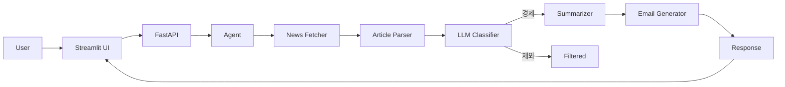
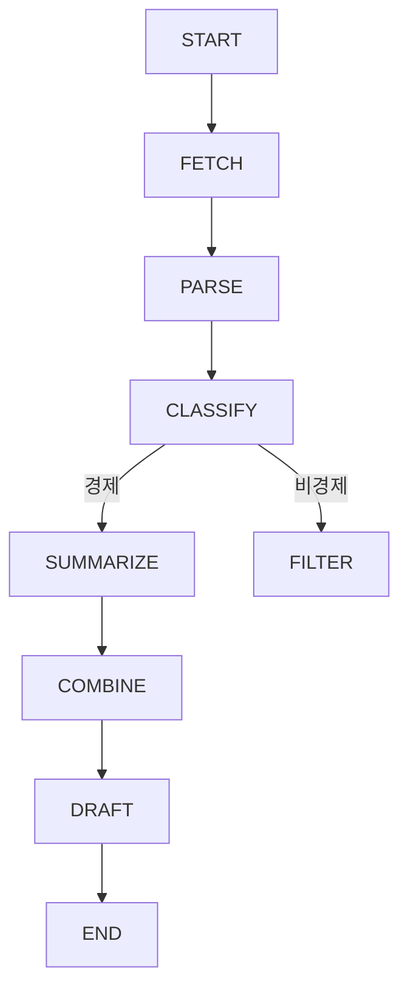

---

# 📌 Hankyung News AI Agent

> 📊 특정 날짜의 한국경제신문 뉴스를 수집 → 요약 → 이메일 초안 자동 생성하는 AI Agent

---

## 🚀 Overview

이 프로젝트는 사용자가 입력한 특정 날짜의 한국경제신문 뉴스를 기반으로
**핵심 이슈를 자동으로 요약하고 이메일 초안을 생성하는 AI Agent 서비스**입니다.

✔️ 뉴스 수집
✔️ 기사 본문 추출
✔️ LLM 기반 경제기사 판별
✔️ 핵심 요약 생성
✔️ 이메일 초안 자동 작성

---

## 🧠 Key Features

### 1. 📡 뉴스 자동 수집

* 날짜 기반 한국경제신문 기사 수집
* 사이트맵 / RSS 기반 안정적 크롤링

### 2. 🧠 LLM 기반 경제기사 판별

* 단순 키워드 필터 ❌
* GPT 기반 판단 ✔️
* 결과 제공:

  * `is_economic`
  * `confidence`
  * `category`
  * `reason`

### 3. ✂️ 스마트 요약

* 기사별 요약
* 전체 트렌드 요약
* 중복 제거 및 핵심 이슈 중심 정리

### 4. ✉️ 이메일 초안 자동 생성

* 업무용 문체 자동 생성
* 제목 + 본문 포함
* 바로 복사/전달 가능

### 5. 📊 Explainable UI (Streamlit)

* 사용된 기사 vs 제외된 기사 구분
* 판단 근거 표시
* confidence 시각화

---

## 🏗️ Architecture



---

## 🔄 Agent Flow (LangGraph)



---

## 📂 Project Structure

```bash
hankyung_news_agent/
├─ app/
│  ├─ main.py
│  ├─ agent.py
│  ├─ graphs/
│  │  └─ langgraph_agent.py
│  ├─ services/
│  │  ├─ news_fetcher.py
│  │  ├─ article_parser.py
│  │  ├─ article_classifier.py
│  │  ├─ summarizer.py
│  │  └─ mail_generator.py
│  ├─ schemas.py
│  └─ config.py
├─ streamlit_app.py
├─ requirements.txt
└─ README.md
```

---

## ⚙️ Installation

```bash
git clone https://github.com/your-repo/hankyung-news-agent.git
cd hankyung-news-agent

python -m venv venv
source venv/bin/activate  # mac
pip install -r requirements.txt
```

---

## 🔑 Environment Variables

`.env` 파일 생성:

```env
OPENAI_API_KEY=your_api_key
OPENAI_MODEL=gpt-4.1-mini
```

---

## ▶️ Run

### FastAPI

```bash
uvicorn app.main:app --reload
```

👉 Swagger:

```
http://127.0.0.1:8000/docs
```

---

### Streamlit UI

```bash
streamlit run streamlit_app.py
```

---

## 📥 API Example

### Request

```json
{
  "target_date": "2026-04-10",
  "max_articles": 5,
  "tone": "business",
  "mode": "langgraph",
  "filter_economic_only": true
}
```

---

### Response

```json
{
  "subject": "[뉴스브리핑] 2026-04-10 주요 뉴스",
  "body": "...",
  "article_details": [
    {
      "title": "...",
      "judgment": {
        "is_economic": true,
        "confidence": 4,
        "category": "market",
        "reason": "경제 지표 관련 기사"
      }
    }
  ]
}
```

---

## 🖥️ UI Features

* 📅 날짜 입력
* 📊 기사 수 선택
* 🧠 경제기사 필터 ON/OFF
* 📈 confidence 시각화
* 📋 이메일 미리보기
* 📄 TXT 다운로드

---

## 🧪 Testing

```bash
pytest tests/
```

---

## ⚠️ Limitations

* 사이트 구조 변경 시 selector 수정 필요
* 일부 유료 기사 접근 제한
* LLM 판단은 100% 정확하지 않음

---

## 🔮 Future Improvements

* Gmail / Slack 자동 전송
* 기사 카테고리 자동 분류
* HTML 이메일 템플릿
* LangSmith 기반 추적
* 멀티 Agent 구조 확장

---

## 💡 Why This Project?

✔️ 실제 업무 자동화 가능
✔️ Agent 구조 학습 가능
✔️ LLM + Tool + UI 통합 경험
✔️ Explainable AI 구현

---


