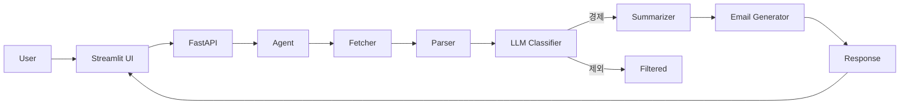

# Hankyung News AI Agent

> 특정 날짜의 한국경제신문 뉴스를 수집 → 요약 → 이메일 초안 자동 생성하는 AI Agent

---

## 🚀 Overview
이 프로젝트는 특정 날짜의 한국경제신문 뉴스를 기반으로 핵심 이슈를 요약하고 이메일 초안을 생성합니다.

---

## 🧠 Key Features
- 뉴스 자동 수집
- LLM 기반 경제기사 판별
- 기사 요약 및 통합 요약
- 이메일 초안 생성
- Streamlit UI 제공

---

## 🏗️ Architecture


---

## ▶️ Run
```bash
uvicorn app.main:app --reload
streamlit run streamlit_app.py
```
