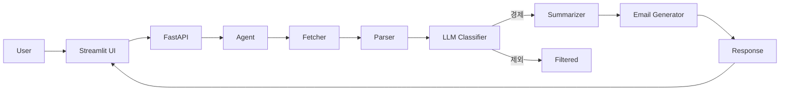

# 🚀 Hankyung News AI Agent


> 📊 한국경제신문 뉴스 → 요약 → 이메일 초안 생성 AI Agent

---

## 🧠 Overview
LLM 기반 Agent를 활용하여 뉴스 브리핑 업무를 자동화하는 프로젝트입니다.

---

## ✨ Features
- 뉴스 자동 수집
- LLM 경제기사 판별
- 기사 요약 및 통합 요약
- 이메일 초안 생성
- Streamlit UI

---

## 🏗️ Architecture


---

## ▶️ Run
```bash
uvicorn app.main:app --reload
streamlit run streamlit_app.py
```

---

## 💡 Strengths
✔️ 실무 자동화  
✔️ Explainable AI  
✔️ 확장 가능한 구조  

---

## 👨‍💻 Author
OKEUI KIM
