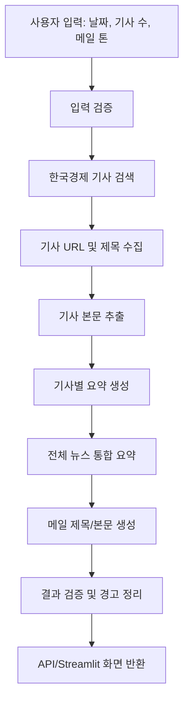
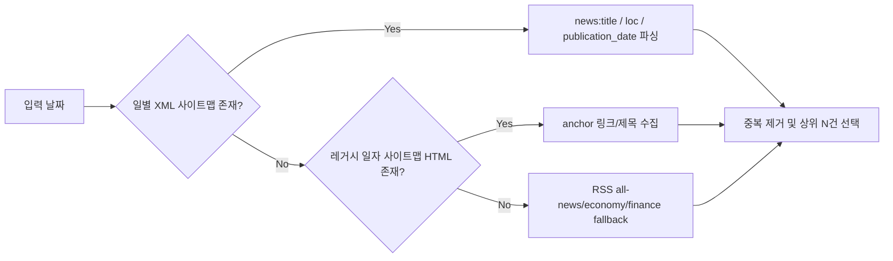
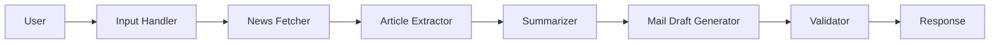
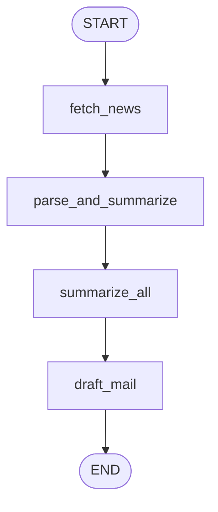
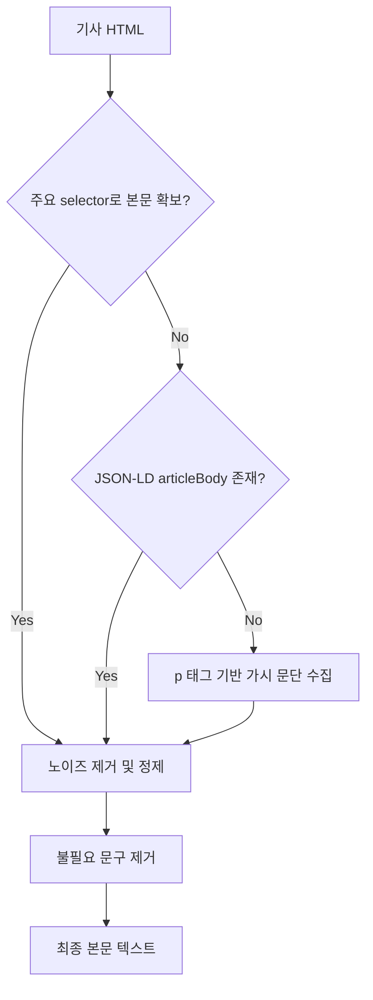
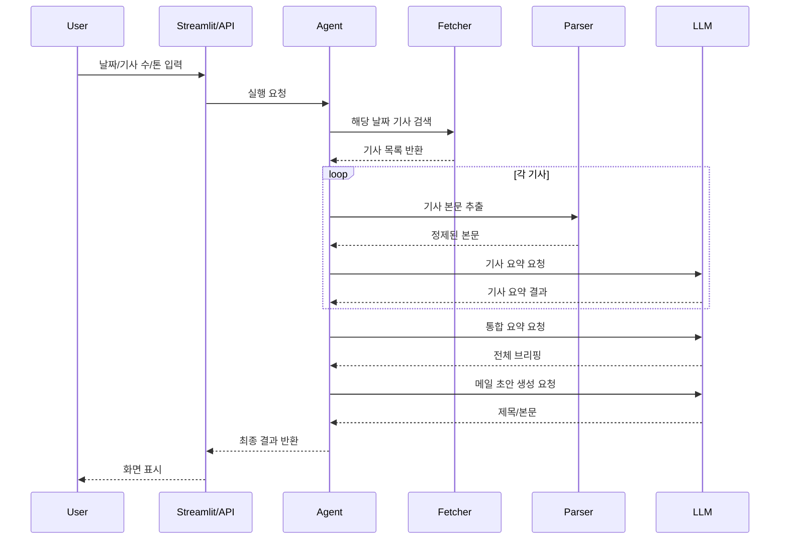
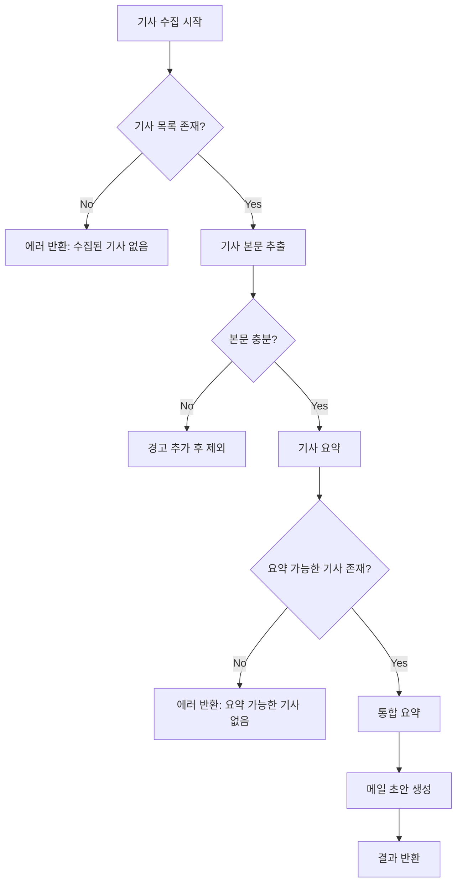

# 한국경제신문 뉴스 요약 및 메일 초안 작성 Agent 설계 문서

## 1. 프로젝트 개요

### 1.1 프로젝트명
한국경제신문 뉴스 요약 및 메일 초안 작성 AI Agent

### 1.2 목표
사용자가 특정 날짜를 입력하면 해당 일자의 한국경제신문 기사를 수집하고, 주요 내용을 요약한 뒤, 이메일 초안을 자동 생성한다.

### 1.3 핵심 가치
- 반복적인 뉴스 브리핑 작성 업무 자동화
- 기사 검색부터 메일 초안 작성까지 한 번에 처리
- 실무 활용이 가능한 형식의 결과 제공

---

## 2. Step1. 과제소개: 주제확인 및 요구사항 분석

### 2.1 문제 정의
사용자는 특정 날짜 경제 뉴스를 찾아보고 핵심 내용을 정리한 뒤, 팀이나 관계자에게 전달할 메일을 작성해야 한다. 이 과정은 반복적이고 시간이 많이 소요된다.

### 2.2 해결 방향
AI Agent가 다음 과정을 자동 수행한다.
1. 특정 날짜 기사 탐색
2. 기사 본문 수집
3. 기사별 요약
4. 통합 브리핑 생성
5. 메일 초안 작성

### 2.3 기능 요구사항
- 날짜 입력을 받아야 한다.
- 해당 날짜 기사 목록을 수집해야 한다.
- 기사 본문을 확보해야 한다.
- 기사별 요약을 생성해야 한다.
- 전체 브리핑 요약을 생성해야 한다.
- 이메일 제목/본문 초안을 작성해야 한다.

### 2.4 비기능 요구사항
- 일부 기사 수집 실패에도 전체 서비스는 동작해야 한다.
- 구조가 모듈화되어 있어야 한다.
- 나중에 다른 언론사로 확장 가능해야 한다.
- 어떤 출처를 사용했는지 확인 가능해야 한다.

### 2.5 Step1 산출물
- 프로젝트 개요서
- 요구사항 명세서
- 사용자 시나리오 문서
- MVP 범위 정의서

---

## 3. Step2. 기획 및 설계: Agent 구조 설계 및 명세

### 3.1 전체 구조



### 3.2 수집 전략 설계



### 3.3 단일 Agent 구조



### 3.4 LangGraph 구조



### 3.5 본문 추출 전략



### 3.6 컴포넌트 설명

| 컴포넌트 | 역할 | 입력 | 출력 |
|---|---|---|---|
| Input Handler | 입력값 검증 | target_date, max_articles, tone | validated request |
| News Fetcher | 사이트맵/RSS 기반 기사 검색 | target_date | article metadata list |
| Article Extractor | 기사 본문 추출 | article_url | article_text |
| Summarizer | 기사별/통합 요약 | article_text list | summaries |
| Mail Draft Generator | 이메일 초안 작성 | summaries, tone | subject, body |
| Validator | 품질 확인 및 경고 생성 | intermediate results | warnings |

### 3.7 데이터 흐름



### 3.8 Tool 명세

#### Tool 1. Search Tool
- 목적: 특정 날짜의 한국경제신문 기사 목록 수집
- 입력: target_date, max_articles
- 출력: 기사 메타데이터 리스트
- 구현 전략: XML 사이트맵 → 레거시 HTML 사이트맵 → RSS fallback
- 예외: 결과 없음, 사이트 구조 변경

#### Tool 2. Article Parser Tool
- 목적: 기사 본문 추출 및 정제
- 입력: article_url
- 출력: cleaned_article_text
- 구현 전략: selector 우선 → JSON-LD → paragraph fallback
- 예외: 본문 selector 변경, 접근 제한

#### Tool 3. Summarization Tool
- 목적: 기사별 요약 및 통합 요약 생성
- 입력: article_text / summaries
- 출력: article_summary / combined_summary
- 예외: 모델 호출 실패, 본문 부족

#### Tool 4. Email Draft Tool
- 목적: 이메일 제목/본문 생성
- 입력: target_date, summaries, tone
- 출력: subject, body
- 예외: 프롬프트 출력 형식 불안정

### 3.9 예외 처리



### 3.10 API 설계

#### POST /generate-email-draft
입력:
```json
{
  "target_date": "2026-04-10",
  "max_articles": 5,
  "tone": "business",
  "mode": "langgraph"
}
```

출력:
```json
{
  "target_date": "2026-04-10",
  "collected_articles": 5,
  "used_articles": 4,
  "subject": "[뉴스브리핑] 2026-04-10 한국경제신문 주요 뉴스 요약",
  "body": "안녕하세요...",
  "sources": [
    {"title": "기사 제목", "url": "https://..."}
  ],
  "warnings": ["기사 처리 실패: ..."],
  "mode": "langgraph"
}
```

### 3.11 Step2 산출물
- 시스템 아키텍처도
- LangGraph 상태 흐름도
- 데이터 흐름도
- Tool 명세서
- API 명세서
- 예외 처리 정책서
- 테스트 케이스 정의서

---

## 4. Step3. 서비스 개발: 실제 개발 및 결과물 제출

### 4.1 단계별 해야 할 일

#### 1단계. 초기 세팅
- FastAPI 및 Streamlit 프로젝트 생성
- 환경변수 설정
- 기본 라우트 구성

산출물:
- requirements.txt
- .env.example
- app/main.py
- streamlit_app.py

#### 2단계. 기사 수집 모듈 구현
- 날짜 기반 사이트맵 조회 함수 작성
- RSS fallback 구성
- URL 정규화 및 중복 제거

산출물:
- app/services/news_fetcher.py

#### 3단계. 기사 파싱 모듈 구현
- HTML 다운로드
- 본문 selector 탐색
- JSON-LD fallback
- 텍스트 정제

산출물:
- app/services/article_parser.py

#### 4단계. 요약 모듈 구현
- 기사별 요약 함수
- 통합 요약 함수
- LLM 클라이언트 연결

산출물:
- app/services/llm_client.py
- app/services/summarizer.py

#### 5단계. 메일 초안 생성 모듈 구현
- 제목/본문 생성 프롬프트 설계
- 출력 파싱

산출물:
- app/services/mail_generator.py

#### 6단계. Agent 오케스트레이션 구현
- 순차형 Agent 구현
- LangGraph 버전 구현
- warnings 누적 및 validation 연결

산출물:
- app/agent.py
- app/graphs/langgraph_agent.py

#### 7단계. UI/API 개발
- FastAPI 엔드포인트 구현
- Streamlit 입력 화면 구현
- 결과 카드/본문/출처/경고 표시

산출물:
- app/main.py
- streamlit_app.py

#### 8단계. 테스트 및 제출 정리
- 샘플 날짜 테스트
- 기사 적은 날짜 테스트
- 본문 추출 실패 테스트
- README 및 발표자료 정리

산출물:
- tests/test_agent.py
- README.md
- 시연 캡처

### 4.2 최종 제출 산출물
- 프로젝트 제안서
- 요구사항 명세서
- mermaid 설계 문서
- FastAPI 소스코드
- Streamlit 화면
- LangGraph 구현 코드
- 테스트 코드
- README
